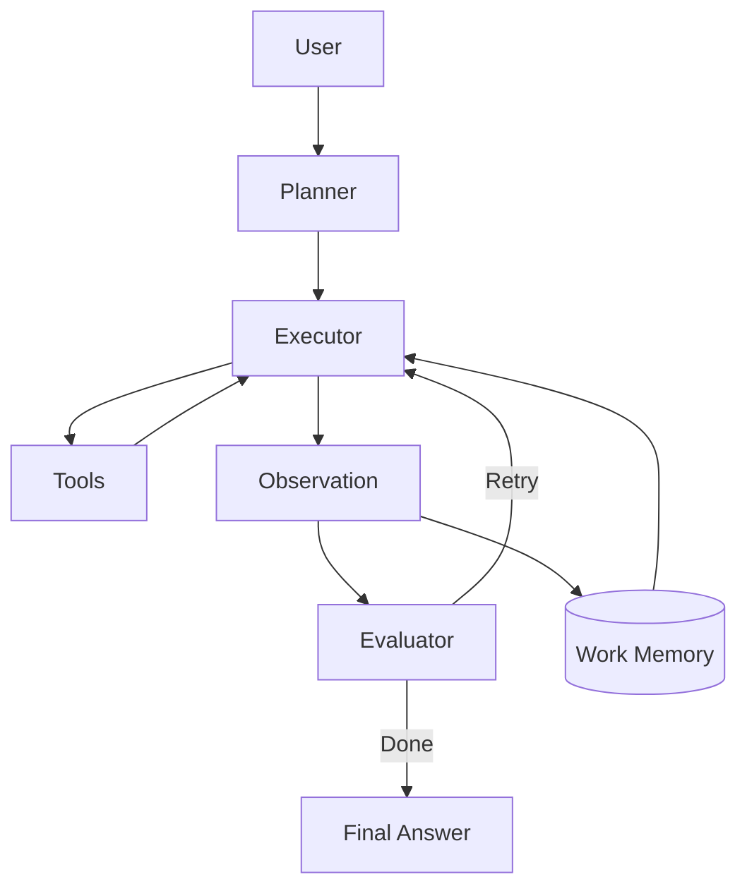

### Workflow

```mermaid
flowchart TD
    A[User] --> B[Planner]
    B --> C[Executor]
    C --> D[Tools]
    D --> C
    C --> E[Observation]
    E --> F[Evaluator]
    F -->|Retry| C
    F -->|Done| G[Final Answer]
    E --> H[(Work Memory)]
    H --> C
```
